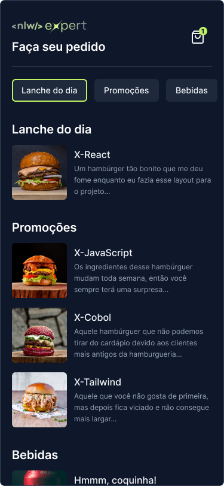
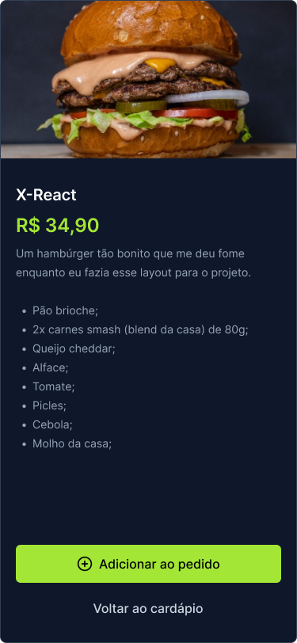

# DeliveryApp - NLW Expert 💜 Rocketseat


Bem-vindo ao repositório do DeliveryApp, um aplicativo mobile de entrega de comida desenvolvido durante o evento NLW Expert da RocketSeat, utilizando React Native.

## Visão Geral


O DeliveryApp é um aplicativo que permite aos usuários explorar visualizar menus, fazer pedidos e receber confirmações através do WhatsApp.

  
  

## Tecnologias Utilizadas

<div style="display: inline_block"><br>
  
  
  
</div>                          


## Protótipo


Confira o protótipo do aplicativo no Figma: https://www.figma.com/file/Omtb20Cfyo84rx6GrfJUsf/NLW-expert-%E2%80%A2-Orders-(Community)?type=design&node-id=116-606&mode=design&t=vdhuf1kpTqbuhJYB-0


## 🔨 Funcionalidades Principais


- **Visualização de Cardápios:** Os menus dos restaurantes estão disponíveis para visualização, permitindo que os usuários escolham seus pratos favoritos.

- **Pedidos Online:** Faça pedidos de forma rápida e fácil, personalizando suas escolhas conforme desejado.

## 🚀 Iniciando o Projeto

Ao clonar o repositório para o seu ambiente de desenvolvimento basta usar o seguinte comando:

```
npx expo start

```
Assim você terá a possibilidade de instalar o aplicativo do Expo no seu celular e escanear o QR Code, ou até mesmo rodar a aplicação em algum emulador, como o Android Studio. Basta seguir as orientações dadas no terminal.
